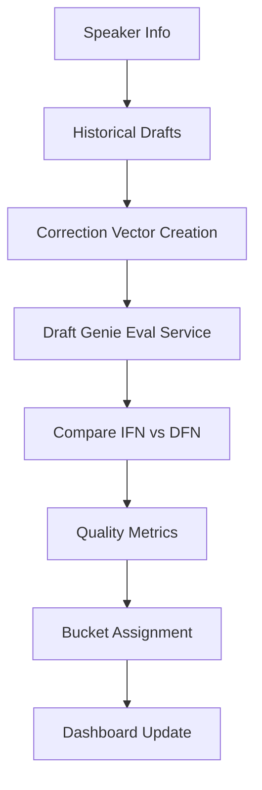

```mermaid
flowchart TD
    A[Speaker Info] --> B[Historical Drafts]
    B --> C[Correction Vector Creation]
    C --> D[Draft Genie Eval Service]
    D --> E[Compare IFN vs DFN]
    E --> F[Quality Metrics]
    F --> G[Bucket Assignment]
    G --> H[Dashboard Update]
```
