# DraftGenie System Documentation

## Abbreviations & Terminology

### System Acronyms
- **AD**: ASR Drafts (from InstaNote)
- **ASR**: Automatic Speech Recognition
- **BSA**: Batch Speaker Addition
- **DFN**: DraftGenie Final Notes
- **IFN**: InstaNote Final Notes
- **LD**: LLM-generated Drafts
- **QA**: Quality Audit
- **RAG**: Retrieval-Augmented Generation
- **SER**: Sentence Edit Rate
- **SSA**: Single Speaker Addition
- **WER**: Word Error Rate

### Technical Terms
- **IAM**: Identity and Access Management
- **LLM**: Large Language Model
- **PII**: Personally Identifiable Information
- **RBAC**: Role-Based Access Control
- **SSO**: Single Sign-On

---

## 1. System Overview

DraftGenie is a Speaker-centric system that begins with Speaker onboarding, then pulls Speaker-specific InstaNote ASR (Automatic Speech Recognition) drafts or LLM-generated drafts and applies user-specific corrections using Retrieval Augmented Generation (RAG) techniques to produce improved final notes.

## 2. High-Level Flow (Speaker-Centric)

### 2.1 Process Flow Description

The DraftGenie system follows a Speaker-centric approach where all processing begins with Speaker onboarding:

1. **Start Speaker Onboarding (SSA/BSA)** → Choose Mode
2. **Get Speaker Info & Metadata** (SER, WER, Buckets)
3. **Pull Speaker-specific Historical Drafts** (ASR drafts (AD), LLM-generated drafts (LD), and Final Notes (FN)) from InstaNote
4. **Create Correction Vector Entries** for the Speaker by comparing the historical drafts
5. **Check for Duplicate Errors** → Store Speaker specific correction data in DraftGenie Vector DB
6. **Apply User-Specific Corrections** using Speaker's Correction Vectors
7. **Invoke RAG Service** with Speaker Context & Historical Data
8. **Produce DraftGenie Final Note (DFN)**
9. **Store DFN in DB**
10. **Draft Comparison Service** → Compare DFN vs InstaNote Final Notes (IFN)
11. **Evaluation Service** → Generate Quality Metrics
12. **Speaker Bucket Reassignment** based on Quality Metrics
13. **Business Dashboard Update**

### 2.2 High-Level Flow Diagram

## 3. Speaker Addition Process

### 3.1 Process Description

The Speaker Addition Process supports both Single Speaker Addition (SSA) and Batch Speaker Addition (BSA):

### 3.2 Speaker Addition Flow Diagram

## 4. Bucket Assignment Flow

### 4.1 Process Description

The Bucket Assignment Flow operates in two distinct stages:

**Stage 1 - Initial Bucket Assignment During Speaker Onboarding:**
- When a Speaker is first added to DraftGenie, the DraftGenie (DG) user manually assigns the Speaker to an initial bucket
- This initial assignment is based on:
  - Information available from InstaNote (such as SER, WER, and existing metadata)
  - Feedback and insights provided by the DG user who is adding the Speaker

**Stage 2 - Dynamic Bucket Reassignment After Onboarding:**
- Once the Speaker is part of the DraftGenie system and has been processed
- The system performs DraftGenie Evaluation of the Speaker's historical drafts
- Based on this evaluation and quality metrics, the Speaker may be automatically moved to a different bucket
- This reassignment reflects the Speaker's actual performance as measured by DraftGenie's quality assessment

### 4.2 Two-Stage Bucket Assignment Flow Diagram

```mermaid
flowchart TD
    %% Stage 1 - Initial Assignment During Onboarding
    subgraph STAGE1["🎯 Stage 1: Initial Bucket Assignment (During Onboarding)"]
        A[Speaker Onboarding Initiated] --> B[DG User Reviews InstaNote Data]
        B --> C[Available Metadata: SER, WER, etc.]
        C --> D[DG User Insights & Feedback]
        D --> E[Manual Initial Bucket Assignment]
        E --> F[Speaker Stored with Initial Bucket]
    end

    %% Stage 2 - Dynamic Reassignment
    subgraph STAGE2["🔄 Stage 2: Dynamic Bucket Reassignment (Post-Onboarding)"]
        G[Speaker Processing Complete] --> H[Historical Drafts Available]
        H --> I[DraftGenie Evaluation Service]
        I --> J[Compare IFN vs DFN]
        J --> K[Generate Quality Metrics]
        K --> L{Quality Metrics vs Current Bucket}
        L -->|Metrics Indicate Different Bucket| M[Automatic Bucket Reassignment]
        L -->|Metrics Confirm Current Bucket| N[Maintain Current Bucket]
        M --> O[Update Speaker Registry]
        N --> O
        O --> P[Dashboard Update]
    end

    %% Connection between stages
    F -.->|Speaker enters system| G

    %% Styling
    classDef stage1 fill:#e3f2fd,stroke:#1976d2,stroke-width:2px
    classDef stage2 fill:#f3e5f5,stroke:#7b1fa2,stroke-width:2px
    classDef decision fill:#fff3e0,stroke:#f57c00,stroke-width:2px

    class A,B,C,D,E,F stage1
    class G,H,I,J,K,M,N,O,P stage2
    class L decision
```

## 5. System Architecture Components

### 5.1 External Sources & Actors
- **InstaNote DB & Services** (📊) - Source of ASR drafts and final notes
- **QA Reviewers** (👥) - Quality Audit and review inputs
- **Admin & Ops** (⚙️) - System administration and operations

### 5.2 DraftGenie Core Platform

#### 5.2.1 Ingestion & Onboarding (📥)
- **Background Scheduler** (⏰) - Schedules processing tasks
- **Speaker Onboarding (SSA/BSA)** (👤) - Manages speaker addition processes
- **Duplicate Check** (🔍) - Prevents duplicate speaker entries

#### 5.2.2 Processing & Intelligence (🧠)
- **Correction Vector Builder** (📐) - Creates speaker-specific correction patterns
- **GenAI Orchestrator (RAG Service)** (🤖) - AI-powered draft generation
- **Draft Comparison (IFN vs DFN)** (⚖️) - Compares draft quality
- **Quality Metrics & Scoring** (📊) - Evaluates draft performance
- **Bucket Assignment Engine** (🗂️) - Categorizes speakers by quality

#### 5.2.3 Data Layer (💾)
- **Speaker Registry** (👥) - Central speaker information store
- **Historical Draft Store** (📚) - Archive of past drafts and notes
- **Correction Vector DB** (🎯) - Speaker-specific correction patterns
- **DFN Store** (📝) - DraftGenie Final Notes repository
- **Metrics & Analytics** (📈) - Performance and quality data
- **Audit & Event Log** (📋) - System activity tracking

#### 5.2.4 Delivery & Experience (🚀)
- **Executive Dashboard & Drill-downs** (📊) - Business intelligence interface
- **Partner/API Gateway** (🔌) - External integrations and webhooks

### 5.3 Cross-Cutting Capabilities (🛡️)
- **Security & IAM** (🔐) - SSO, RBAC, PII protection
- **Observability** (👁️) - Monitoring and alerting
- **Config & Feature Flags** (⚡) - System configuration management

## 6. Core Service Definition

This section defines the minimum core microservices that align with the Speaker-centric architecture: responsibilities, scope, inputs/outputs, and relationships to architecture components.

### 6.1 Speaker Management Service
Primary responsibility: Own the Speaker lifecycle and registry; onboarding (SSA/BSA), validation/deduplication, and initial (manual) bucket assignment during onboarding.

Key functions/scope:
- Speaker onboarding (SSA/BSA), validation, duplicate checks
- Manage Speaker Registry (profiles, metadata: SER, WER, buckets)
- Initial bucket assignment based on InstaNote info and DG user input

Inputs/Outputs:
- In: Speaker info, InstaNote metadata (SER, WER, etc.), DG user feedback
- Out: Speaker records in Speaker Registry; initial bucket set; “speaker onboarded” event

Relationships:
- Data Layer: Speaker Registry
- Ingestion: triggers Draft Ingestion for onboarded speakers
- Bucket Assignment: Stage 1 (manual during onboarding)

### 6.2 Draft Ingestion Service
Primary responsibility: Pull speaker-specific ASR drafts (AD), LLM-generated drafts (LD), and historical final notes (IFN) from InstaNote; schedule ingestion; persist to Historical Draft Store.

Key functions/scope:
- Background Scheduler–driven pulls for onboarded speakers
- Fetch historical drafts (AD, LD, IFN) and link to speakers
- Data validation and storage in Historical Draft Store

Inputs/Outputs:
- In: Onboarded speaker IDs/events; InstaNote APIs
- Out: Historical drafts (AD, LD, IFN) in Historical Draft Store

Relationships:
- Data Layer: Historical Draft Store
- Upstream: Speaker Management (onboarding events)
- Downstream: Correction Vector Service (historical data)

### 6.3 Correction Vector Service
Primary responsibility: Build/maintain speaker-specific correction vectors using historical drafts and speaker context; manage Correction Vector DB.

Key functions/scope:
- Analyze historical data to construct correction patterns
- Update/regenerate vectors as more data becomes available
- Serve vectors to RAG for generation-time personalization

Inputs/Outputs:
- In: Speaker Registry (profiles, buckets), Historical Draft Store (history)
- Out: Correction vectors per speaker in Correction Vector DB

Relationships:
- Data Layer: Correction Vector DB
- Upstream: Draft Ingestion, Speaker Management
- Downstream: RAG Orchestration (consumes vectors)

### 6.4 RAG Orchestration Service
Primary responsibility: Orchestrate GenAI draft generation (DFN) using speaker context, historical signals, and correction vectors; manage DFN Store.

Key functions/scope:
- Invoke RAG with speaker context + correction vectors + history
- Produce DFN artifacts; persist to DFN Store
- Versioning/traceability of generated notes

Inputs/Outputs:
- In: Speaker context (Registry), Correction Vectors (DB), Historical context
- Out: DFN persisted in DFN Store; generation metadata

Relationships:
- Data Layer: DFN Store
- Upstream: Correction Vector Service, Draft Ingestion, Speaker Management
- Downstream: Evaluation & Bucketing (consumes DFN)

### 6.5 Evaluation & Bucketing Service
Primary responsibility: Compare DFN vs IFN, compute quality metrics, publish analytics, and perform Stage 2 bucket reassignment (automatic, post-onboarding).

Key functions/scope:
- Draft Comparison (IFN vs DFN); Quality Metrics & Scoring
- Automatic bucket reassignment based on measured performance
- Persist metrics to Metrics & Analytics; update Speaker Registry bucket

Inputs/Outputs:
- In: DFN (DFN Store), IFN (from Historical Draft Store), current bucket
- Out: Metrics, analytics, bucket reassignment updates to Speaker Registry

Relationships:
- Processing: Draft Comparison, Quality Metrics & Scoring, Bucket Assignment Engine
- Data Layer: Metrics & Analytics; updates to Speaker Registry
- Delivery: feeds Dashboard with metrics and reassignment events

### 6.6 API Gateway & Dashboard Service
Primary responsibility: Provide executive dashboard & drill-downs; expose partner/webhook APIs; aggregate views over core data stores for reporting.

Key functions/scope:
- Secure APIs for partners/integrations; webhooks/exports
- BI views: speakers, buckets, metrics, DFN summaries
- Cross-service aggregation and caching for UI performance

Inputs/Outputs:
- In: Speaker Registry, Metrics & Analytics, DFN summaries, reassignment events
- Out: UI dashboards; partner APIs; reports/exports

Relationships:
- Delivery & Experience layer
- Reads across Data Layer; surfaces results from Processing services

### 6.7 Service Interaction Pattern (Overview)

## 7. Key Data Flows

### 7.1 Ingestion Flows (Speaker-Centric)
- **Speaker Onboarding (SSA/BSA)** → Get Speaker Info & Metadata
- **Speaker Onboarding** → Pull Speaker-specific ASR Drafts (AD) and LLM-generated Drafts (LD) from InstaNote
- **Speaker Onboarding** → Fetch Historical Drafts (AD, LD, IFN) for Speaker → Historical Draft Store
- **QA Reviewers** → Speaker Notes, Review Inputs → Speaker Onboarding
- **Speaker Onboarding** → Validate & Process → Duplicate Check
- **Duplicate Check** → Store Speaker Data → Speaker Registry
- **Background Scheduler** → Schedule Processing for Onboarded Speakers

### 7.2 Vector Building Flows
- **Speaker Registry** → Speaker Profiles → Correction Vector Builder
- **Historical Draft Store** → Historical Data → Correction Vector Builder
- **Correction Vector Builder** → Generated Vectors → Correction Vector DB

### 7.3 RAG Processing Flows
- **Speaker Registry** → Speaker Context → GenAI Orchestrator (RAG Service)
- **Correction Vector DB** → Correction Vectors → GenAI Orchestrator (RAG Service)
- **Historical Draft Store** → Historical Context → GenAI Orchestrator (RAG Service)
- **GenAI Orchestrator (RAG Service)** → Generated Drafts → DFN Store

## 8. Summary

This documentation captures the Speaker-centric architecture of the DraftGenie system, where all processes begin with Speaker onboarding and flow through to quality assessment and business intelligence. The system emphasizes personalized correction vectors and AI-powered draft improvement based on individual speaker patterns and historical performance data.
