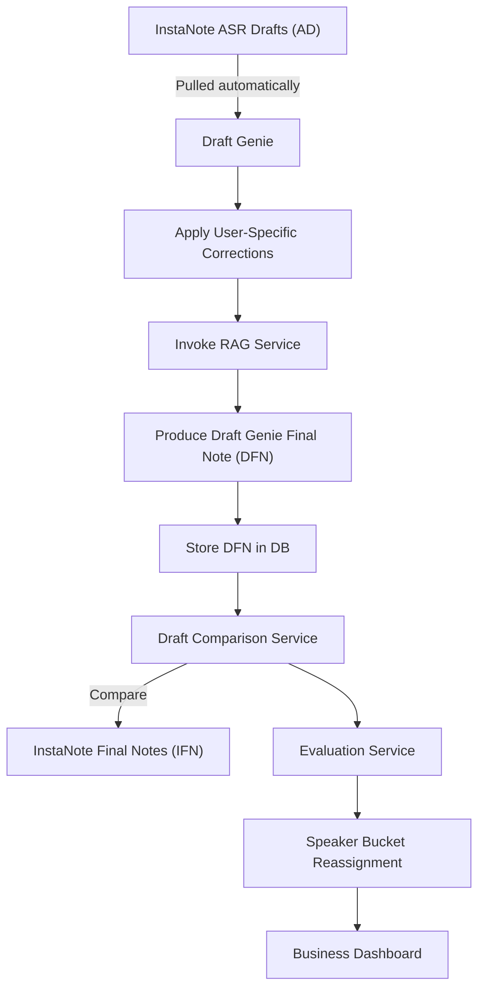

```mermaid
flowchart TD
    A["InstaNote ASR Drafts (AD)"] -->|Pulled automatically| B[Draft Genie]
    B --> C[Apply User-Specific Corrections]
    C --> D[Invoke RAG Service]
    D --> E["Produce Draft Genie Final Note (DFN)"]
    E --> F[Store DFN in DB]
    F --> G[Draft Comparison Service]
    G -->|Compare| H["InstaNote Final Notes (IFN)"]
    G --> I[Evaluation Service]
    I --> J[Speaker Bucket Reassignment]
    J --> K[Business Dashboard]
``` 