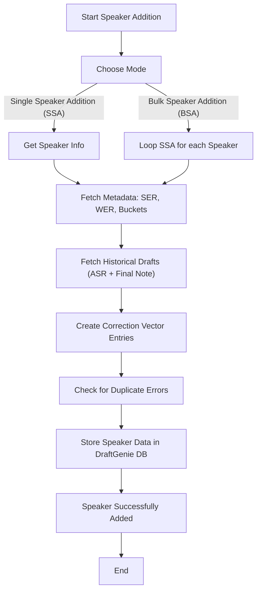

```mermaid
flowchart TD
    A[Start Speaker Addition] --> B[Choose Mode]
    B -->|"Single Speaker Addition (SSA)"| C[Get Speaker Info]
    B -->|"Bulk Speaker Addition (BSA)"| D[Loop SSA for each Speaker]
    
    C --> E[Fetch Metadata: SER, WER, Buckets]
    E --> F["Fetch Historical Drafts (ASR + Final Note)"]
    F --> G[Create Correction Vector Entries]
    G --> H[Check for Duplicate Errors]
    H --> I[Store Speaker Data in DraftGenie DB]
    
    D --> E
    I --> J[Speaker Successfully Added]
    J --> K[End]
```