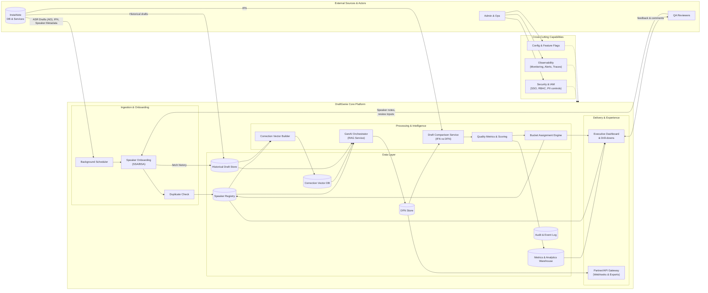

```mermaid
flowchart LR
    %% --- EXTERNAL SOURCES / ACTORS ---
    subgraph EXT[External Sources & Actors]
      IN[(InstaNote\nDB & Services)]
      QA[QA Reviewers]
      ADM[Admin & Ops]
    end

    %% --- DRAFTGENIE CORE PLATFORM ---
    subgraph CORE[DraftGenie Core Platform]
      direction TB

      subgraph ING[Ingestion & Onboarding]
        SCH[Background Scheduler]
        SSA["Speaker Onboarding\n(SSA/BSA)"]
        DUP[Duplicate Check]
      end

      subgraph PROC[Processing & Intelligence]
        CVB[Correction Vector Builder]
        RAG["GenAI Orchestrator\n(RAG Service)"]
        CMP["Draft Comparison Service\n(IFN vs DFN)"]
        EVAL[Quality Metrics & Scoring]
        BKT[Bucket Assignment Engine]
      end

      subgraph DATA[Data Layer]
        SR[(Speaker Registry)]
        HD[(Historical Draft Store)]
        CV[(Correction Vector DB)]
        DFN[(DFN Store)]
        MET[(Metrics & Analytics Warehouse)]
        AUD[(Audit & Event Log)]
      end

      subgraph DELIV[Delivery & Experience]
        DASH[Executive Dashboard\n& Drill-downs]
        API["Partner/API Gateway\n(Webhooks & Exports)"]
      end
    end

    %% --- PLATFORM GUARDRAILS ---
    subgraph XFN[Cross-Cutting Capabilities]
      SEC["Security & IAM\n(SSO, RBAC, PII controls)"]
      OBS["Observability\n(Monitoring, Alerts, Traces)"]
      CFG[Config & Feature Flags]
    end

    %% --- DATA FLOWS ---

    %% Ingestion
    IN -- "ASR Drafts (AD), IFN, Speaker Metadata" --> SCH
    SCH --> SSA
    QA -->|Speaker notes,\nreview inputs| SSA
    SSA --> DUP --> SR
    SSA -->|fetch history| HD
    IN -- "Historical drafts" --> HD

    %% Build correction vectors
    SR --> CVB
    HD --> CVB
    CVB --> CV

    %% RAG generation -> DFN
    SR --> RAG
    CV --> RAG
    HD --> RAG
    RAG --> DFN

    %% Compare & evaluate
    IN -- "IFN" --> CMP
    DFN --> CMP
    CMP --> EVAL
    EVAL --> MET
    EVAL --> BKT
    BKT --> SR

    %% Dashboards & APIs
    MET --> DASH
    SR --> DASH
    BKT --> DASH
    DFN --> API
    DASH <-->|feedback & comments| QA

    %% Guardrails connections
    SEC -.-> CORE
    OBS -.-> CORE
    CFG -.-> CORE

    %% Admin / Ops
    ADM --> SEC
    ADM --> OBS
    ADM --> CFG
```