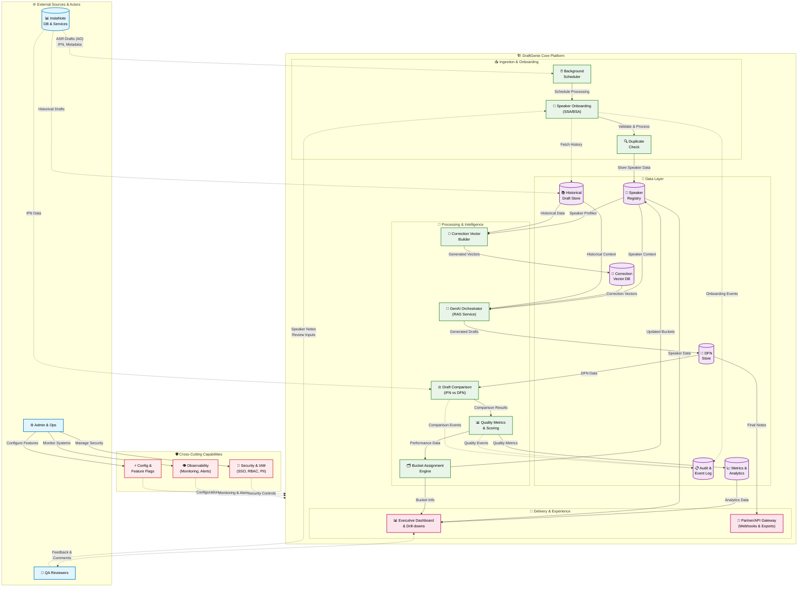

```mermaid
flowchart TB
    %% === EXTERNAL SOURCES & ACTORS ===
    subgraph EXT["🌐 External Sources & Actors"]
        direction LR
        IN[("📊 InstaNote<br/>DB & Services")]
        QA["👥 QA Reviewers"]
        ADM["⚙️ Admin & Ops"]
    end

    %% === DRAFTGENIE CORE PLATFORM ===
    subgraph CORE["🏗️ DraftGenie Core Platform"]
        direction TB
        
        %% Ingestion Layer
        subgraph ING["📥 Ingestion & Onboarding"]
            direction LR
            SCH["⏰ Background<br/>Scheduler"]
            SSA["👤 Speaker Onboarding<br/>(SSA/BSA)"]
            DUP["🔍 Duplicate<br/>Check"]
        end

        %% Processing Layer  
        subgraph PROC["🧠 Processing & Intelligence"]
            direction LR
            CVB["📐 Correction Vector<br/>Builder"]
            RAG["🤖 GenAI Orchestrator<br/>(RAG Service)"]
            CMP["⚖️ Draft Comparison<br/>(IFN vs DFN)"]
            EVAL["📊 Quality Metrics<br/>& Scoring"]
            BKT["🗂️ Bucket Assignment<br/>Engine"]
        end

        %% Data Layer
        subgraph DATA["💾 Data Layer"]
            direction LR
            SR[("👥 Speaker<br/>Registry")]
            HD[("📚 Historical<br/>Draft Store")]
            CV[("🎯 Correction<br/>Vector DB")]
            DFN[("📝 DFN<br/>Store")]
            MET[("📈 Metrics &<br/>Analytics")]
            AUD[("📋 Audit &<br/>Event Log")]
        end

        %% Delivery Layer
        subgraph DELIV["🚀 Delivery & Experience"]
            direction LR
            DASH["📊 Executive Dashboard<br/>& Drill-downs"]
            API["🔌 Partner/API Gateway<br/>(Webhooks & Exports)"]
        end
    end

    %% === CROSS-CUTTING CAPABILITIES ===
    subgraph XFN["🛡️ Cross-Cutting Capabilities"]
        direction TB
        
        SEC["🔐 Security & IAM<br/>(SSO, RBAC, PII)"]
        OBS["👁️ Observability<br/>(Monitoring, Alerts)"]
        CFG["⚡ Config &<br/>Feature Flags"]
    end

    %% === PRIMARY DATA FLOWS ===
    
    %% Ingestion flows
    IN -.->|"ASR Drafts (AD)<br/>IFN, Metadata"| SCH
    SCH -->|"Schedule Processing"| SSA
    QA -.->|"Speaker Notes<br/>Review Inputs"| SSA
    SSA -->|"Validate & Process"| DUP
    DUP -->|"Store Speaker Data"| SR
    SSA -.->|"Fetch History"| HD
    IN -.->|"Historical Drafts"| HD

    %% Vector building flows
    SR -->|"Speaker Profiles"| CVB
    HD -->|"Historical Data"| CVB
    CVB -->|"Generated Vectors"| CV

    %% RAG processing flows
    SR -->|"Speaker Context"| RAG
    CV -->|"Correction Vectors"| RAG
    HD -->|"Historical Context"| RAG
    RAG -->|"Generated Drafts"| DFN

    %% Comparison & evaluation flows
    IN -.->|"IFN Data"| CMP
    DFN -->|"DFN Data"| CMP
    CMP -->|"Comparison Results"| EVAL
    EVAL -->|"Quality Metrics"| MET
    EVAL -->|"Performance Data"| BKT
    BKT -->|"Updated Buckets"| SR

    %% Delivery flows
    MET -->|"Analytics Data"| DASH
    SR -->|"Speaker Data"| DASH
    BKT -->|"Bucket Info"| DASH
    DFN -->|"Final Notes"| API
    DASH <-.->|"Feedback &<br/>Comments"| QA

    %% Audit flows
    EVAL -.->|"Quality Events"| AUD
    SSA -.->|"Onboarding Events"| AUD
    CMP -.->|"Comparison Events"| AUD

    %% === CROSS-CUTTING CONNECTIONS ===
    SEC -.->|"Security Controls"| CORE
    OBS -.->|"Monitoring & Alerts"| CORE
    CFG -.->|"Configuration"| CORE

    %% Admin connections
    ADM -->|"Manage Security"| SEC
    ADM -->|"Monitor Systems"| OBS
    ADM -->|"Configure Features"| CFG

    %% === STYLING ===
    classDef external fill:#e1f5fe,stroke:#0277bd,stroke-width:2px,color:#000
    classDef database fill:#f3e5f5,stroke:#7b1fa2,stroke-width:2px,color:#000
    classDef service fill:#e8f5e8,stroke:#388e3c,stroke-width:2px,color:#000
    classDef process fill:#fff3e0,stroke:#f57c00,stroke-width:2px,color:#000
    classDef delivery fill:#fce4ec,stroke:#c2185b,stroke-width:2px,color:#000
    classDef security fill:#ffebee,stroke:#d32f2f,stroke-width:2px,color:#000

    class IN,QA,ADM external
    class SR,HD,CV,DFN,MET,AUD database
    class SCH,SSA,DUP,CVB,RAG,CMP,EVAL,BKT service
    class DASH,API delivery
    class SEC,OBS,CFG security
```