# DraftGenie Visual Workflows & User Journey Maps

**Version:** 1.0  
**Last Updated:** 2025-10-16  
**Companion to:** `ui_ux_design_specification.md`

---

## Table of Contents

1. [User Journey Maps](#1-user-journey-maps)
2. [Detailed Workflow Diagrams](#2-detailed-workflow-diagrams)
3. [Screen Flow Diagrams](#3-screen-flow-diagrams)
4. [State Diagrams](#4-state-diagrams)
5. [Error Flow Diagrams](#5-error-flow-diagrams)

---

## 1. User Journey Maps

### 1.1 Administrator Journey: Speaker Onboarding

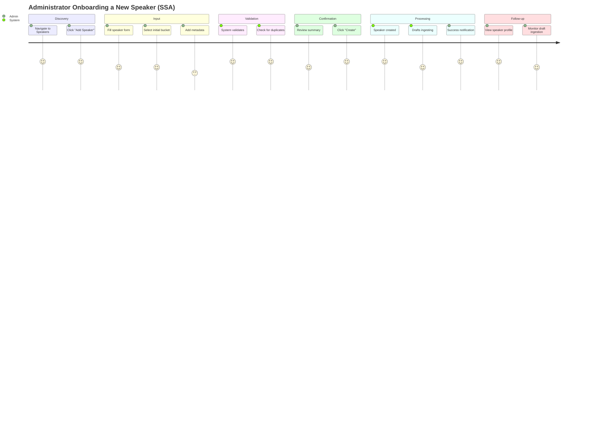

### 1.2 Quality Analyst Journey: Evaluation Review

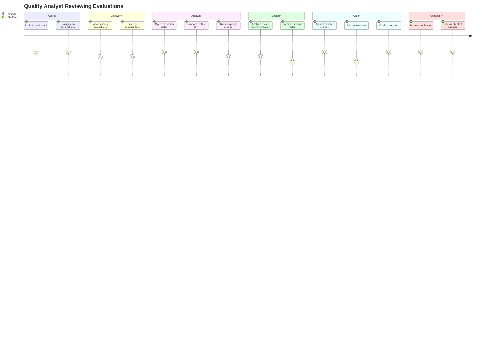

### 1.3 Speaker Journey: Viewing Performance

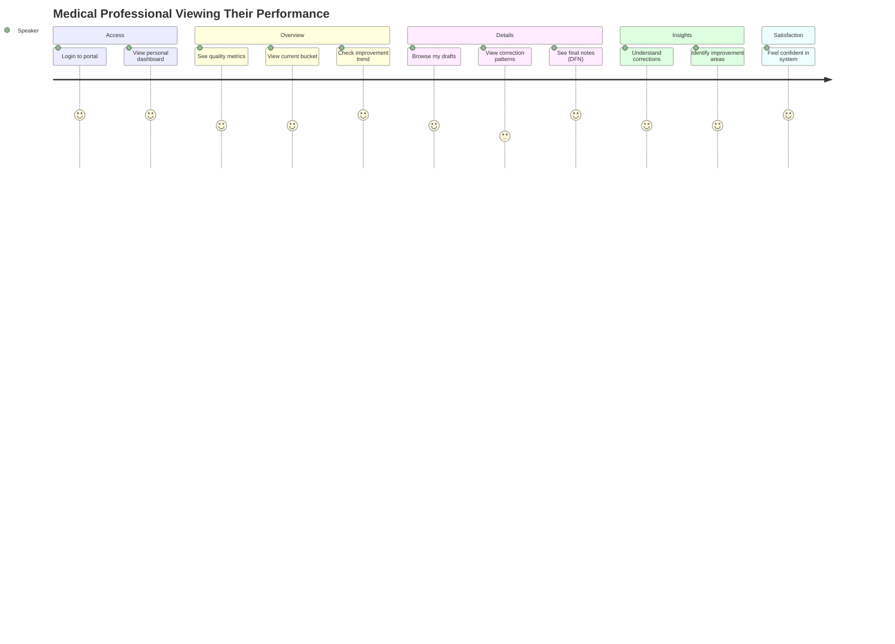

---

## 2. Detailed Workflow Diagrams

### 2.1 Complete Speaker Onboarding Workflow (SSA)

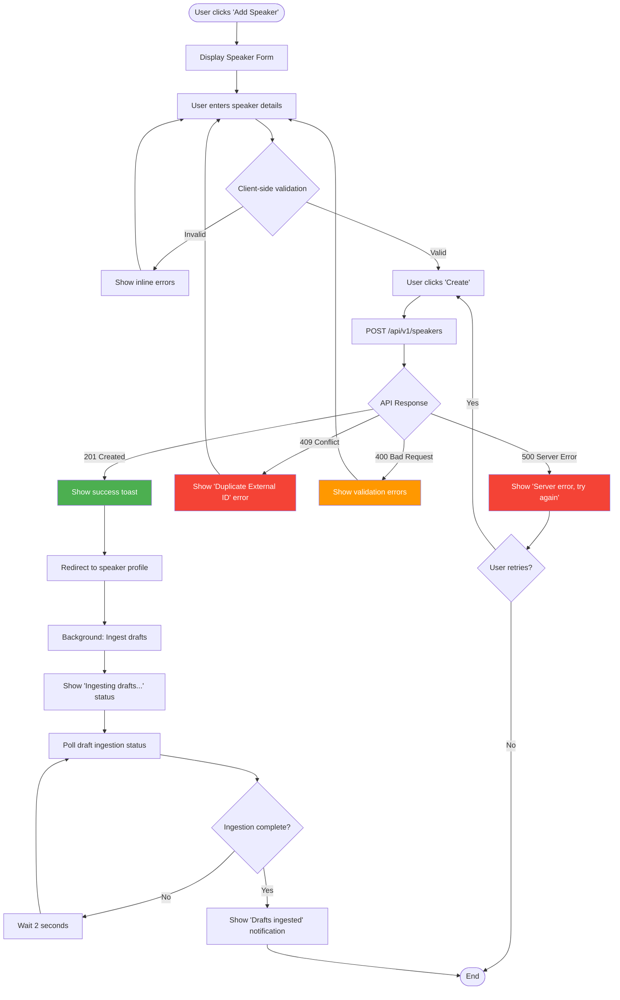

### 2.2 Batch Speaker Addition Workflow (BSA)

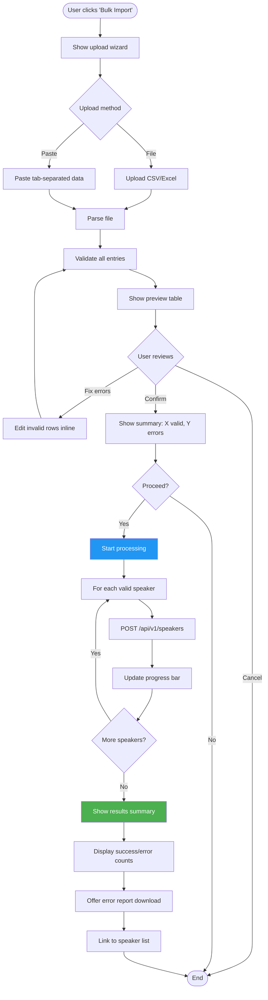

### 2.3 DFN Generation Workflow

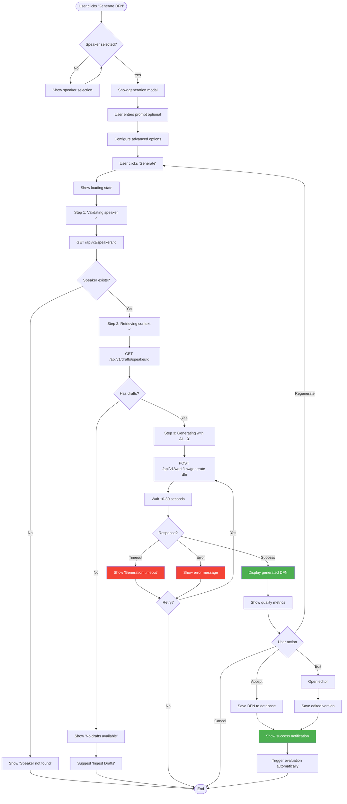

### 2.4 Evaluation & Bucket Reassignment Workflow

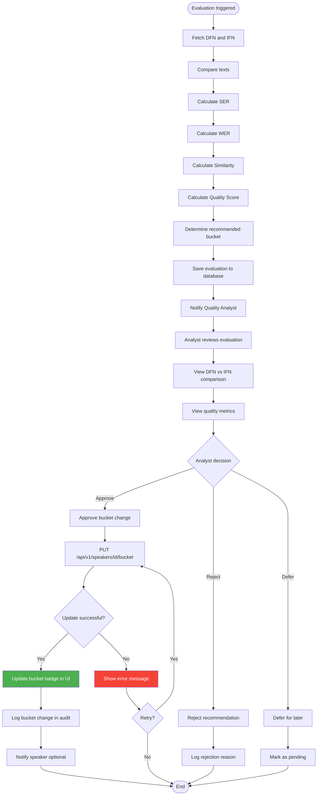

---

## 3. Screen Flow Diagrams

### 3.1 Main Navigation Flow

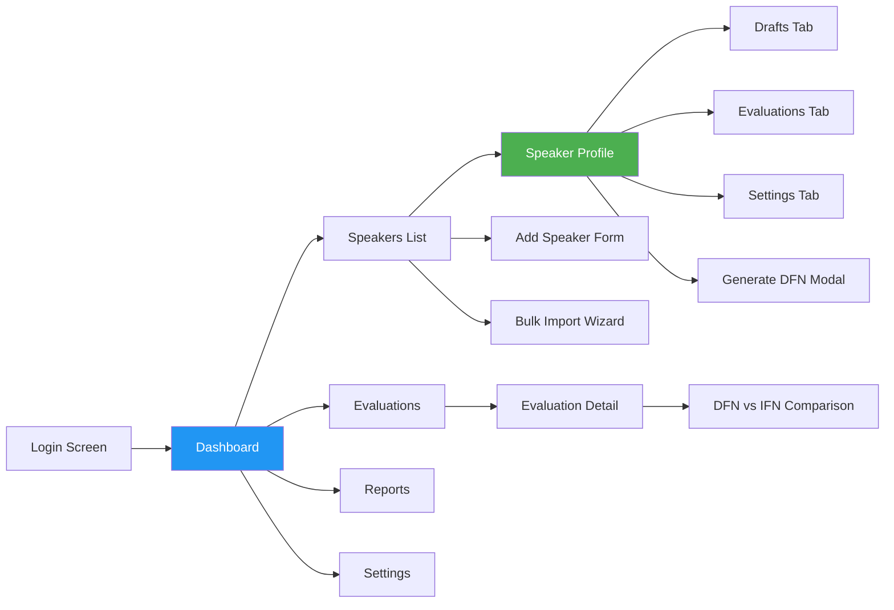

### 3.2 Speaker Management Flow

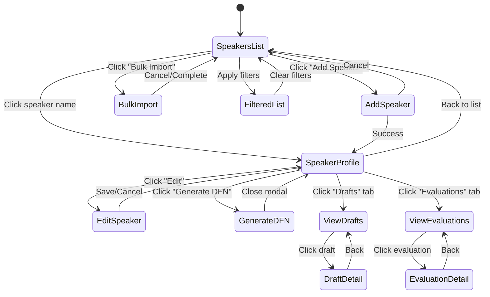

---

## 4. State Diagrams

### 4.1 Speaker State Lifecycle

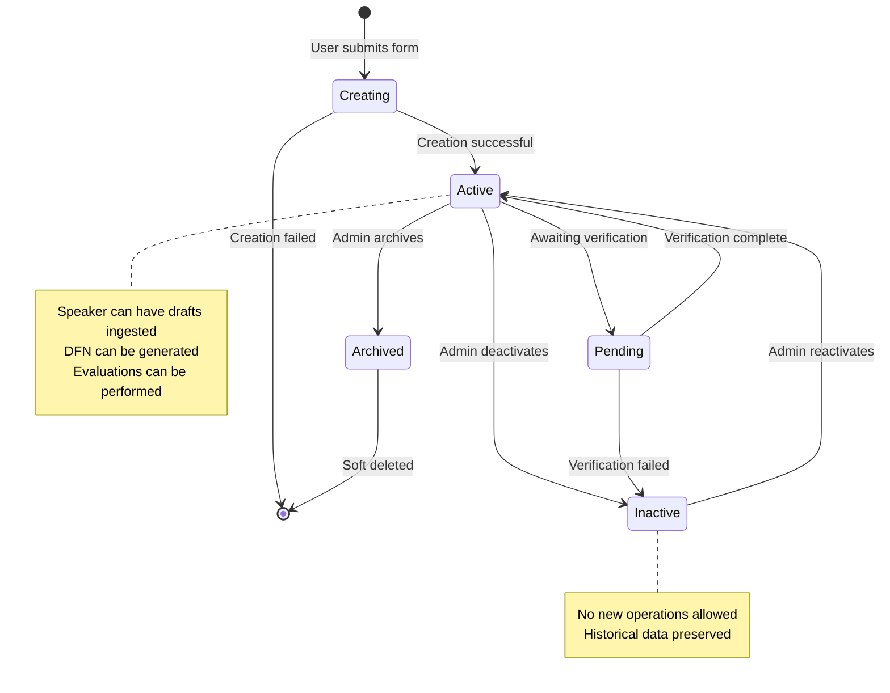

### 4.2 Draft Processing State

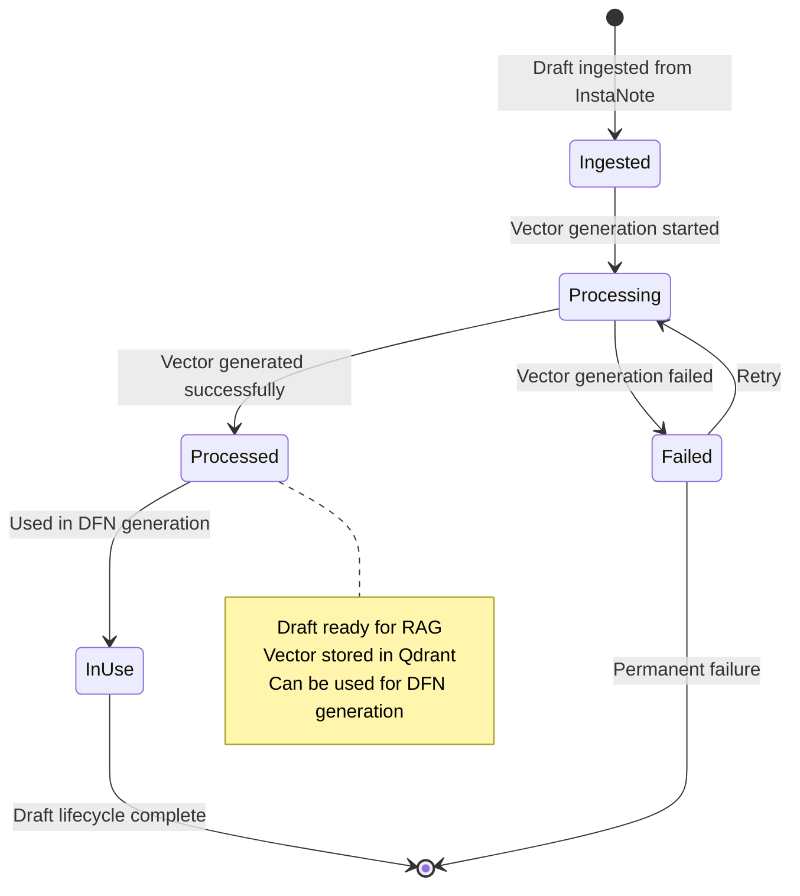

### 4.3 Evaluation State

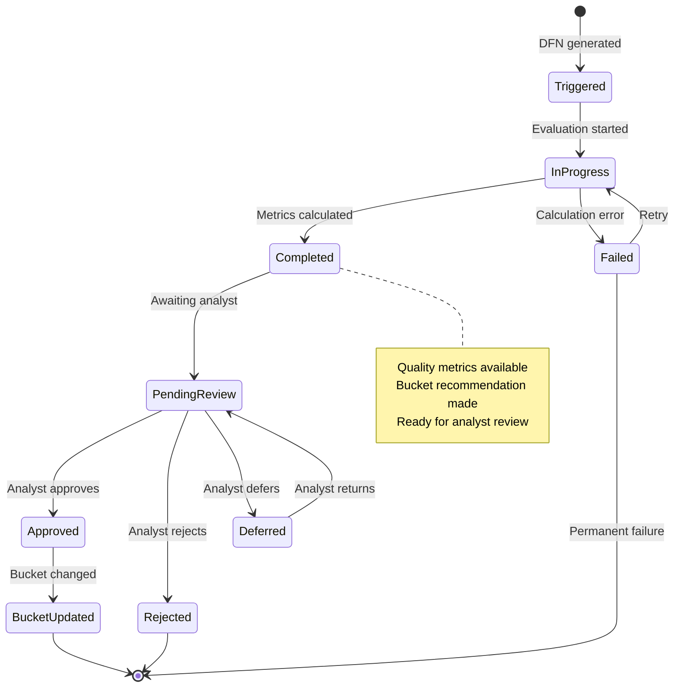

---

## 5. Error Flow Diagrams

### 5.1 Authentication Error Flow

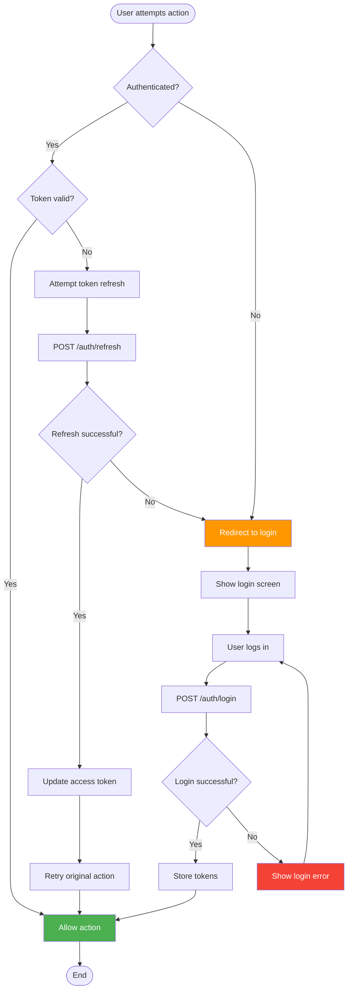

### 5.2 API Error Handling Flow

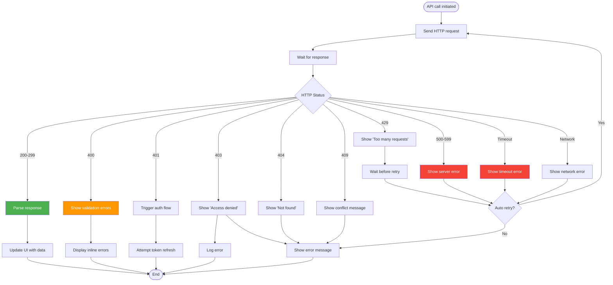

---

## Usage Guidelines

### For Designers
- Use these diagrams as reference when creating mockups
- Ensure all states and transitions are represented in designs
- Consider error states and edge cases

### For Developers
- Implement state management based on state diagrams
- Follow error handling patterns from error flow diagrams
- Use workflow diagrams to understand business logic

### For QA/Testing
- Create test cases based on workflow diagrams
- Verify all state transitions work correctly
- Test error scenarios from error flow diagrams

---

**Document Version:** 1.0  
**Last Updated:** 2025-10-16  
**Related Documents:**
- `ui_ux_design_specification.md` - Main specification
- `FRONTEND_API_DOCUMENTATION.md` - API reference
- `system_architecture_and_implementation_plan.md` - System architecture

